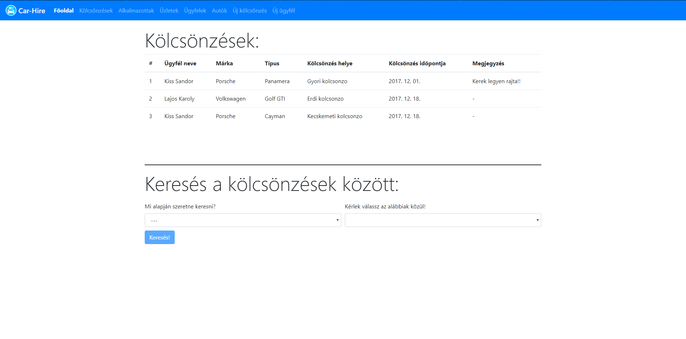

#  CarHire

## 1. Követelményanalízis
**Egyszerű autók kölcsönzését/bérbeadását kezelő app. Eltárolhatjuk a kölcsönzők adatait, az autók adatait és az ügyintézők adatait is**

### 1.1 Követelmények

#### Funkcionális követelmények
 - Üdvözlő oldal
 - Kölcsönzésel böngészése
    - Keresés adott tulajdonságok alapján (lista felajánlása)
 - Alkalmazottak adatainak listázása
 - Üzletek adatainak listázása
 - Ügyfelek adatainak listázása
 - Autók adatainak listázása
 - Új kölcsönzés felvétele
    - Név kiválasztása a listából
    - Üzlet kiválasztása a listából
    - Autó márka kiválasztása a listából
    - Autó típusa kiválasztása a listából
    - Egyéb megjegyzés hozzáfűzése
  - Új ügyfél felvétele
    - Név megadása
    - Születési dátumának megadása
    - Címének megadása
    - Személy igazolvány számának megadása
    - Nemének kiválasztása
#### Nem funkcionális követelmények
  - Felhasználóbarát: Megfelelően elhatárolt funkciók. Világos látható színekkel írt betűk. Ésszerű elrendezés
  - Gyors működés: Adatbázisban operáló program, gyors kereséssekkel hamar előállítja a kívánt eredményeket.
  - Listák használata a hibák és konfliktusok elkerülése érdekében

### 1.2 Szakterületi fogalomjegyzék
  - Autók típusa: A gyártó által megadott típus megnevezés. Pl.: Panamera(Porsche),Golf GTI(Volkswagen)
  - Kölcsönzés tulajdonságok: Ügyfél neve, Autó márkája, Autó típusa, Üzlet neve

### 1.3 Használatieset-modell
    
#### Szerepek
- Vendég
- Felhasználó
- Ügyintéző

#### Modell

#### Folyamat 
  - Autó foglalás:
    1. Új ügyfél felvételénél bevisszük az adatainkat
    2. Megjelenik az ügyfelekközt a nevünk
    3. Választjuk az autók listájából a megfelelő autót
    4. Új kölycsönzés létrehozásánál kivállasztjuk a megfelelő adatokat
    5. Kölcsönzés leadásával véglegesítjük a kölcsönzést
    
  
### Use-case modell
  

##### Egy egyszerű foglalás menete

 1. Először bejelentkezünk a szolgáltatásba.
 2. Böngészhetünk az autók között, vagy foglalhatunk időpontot.
 3. Kiválasztunk egy autót.
 4. Megadjuk mikor vesszük fel az autót.
 
## 2. Tervezés
### 2.1 Oldaltérkép 
  - Főoldal: Üdvözlő képernyő
  - Kölcsönzések: Meglévő köcsönzések böngészése
  - Alkalmazottak: Alkalmazottak adatainak listázása
  - Üzletek: Üzletek adatainak listázása
  - Ügyfelek: Ügyfelek adatainak listázása
  - Autók: Autók adatainak listázása
  - Új kölcsönzés: Új köcsönzés adatainak beállítása
  - Új ügyfél: Új ügyfél megadása
 
### 2.2 Végpontok 
  - GET/ : Főoldal
  - GET/rents : Kölcsönzések
  - GET/employees : Alkalmazottak
  - GET/stores : Üzletek
  - GET/customers : Ügyfelek
  - GET/cars : Autók
  - GET/add-rent : Új kölcsönzés
  - GET/add-customer : Új ügyfél 
### 2.3 Design 
  #### Főoldal
  
  #### Kölcsönzések
  
  #### Alkalmazottak
  
  #### Üzletek
  
  #### Ügyfelek
  
  #### Autók
  
  #### Új kölcsönzések
  
  #### Új ügyfél
  

## 3. Implementáció

### 3.1 Adatbázisterv

### 3.2 Fejlesztőkörnyezet

Lokális IDE: Visual Studio Code 
 - Github account nem szükséges, de hasznos
 - Hozzunk létre egy munkakönyvtárat
 - node.js-el töltsük le az adonisJS-t
 - adonissJS hozzuk létre a fejlesztő környezetet
 - Ezen a munkaterületen elkezdhetünk kódolni
 - Miután végeztünk a munkával elmenthetjük lokálisan vagy github-ra
 - Githubra először a Visual Studio-n belül a Stage All-al kijelöljük a pusholni kívánt 
 fájlokat majd commit-áljuk őket. Ezután a Push paranccsal föltölthetjük a github accountunkra
### 3.3 Könyvtárstruktura
 - Componets
   - car-list.componet.ts
   - carrousel.componet.ts
   - customer-from.componet.ts
   - customer-list.componet.ts
   - employee-list.componet.ts
   - main-page.componet.ts
   - nav-bar.componet.ts
   - rent-filter.componet.ts
   - rent-form.componet.ts
   - rent-list.componet.ts
   - store-list.componet.ts
 - Models
   - car.ts
   - customer.ts
   - employee.ts
   - filter.ts
   - person.ts
   - rent.ts
   - store.ts
 - Service
   - car.service.ts
   - customer.service.ts
   - employee.service.ts
   - rent.service.ts
   - store.service.ts
 - Routing
   - routing.module.ts
 - server.js
### 3.4 Funkciók

### 3.5 Újítások szerveroldalon

## 4. Tesztelés
### 5.1 Selenium IDE Telepítése:
  0. Szükséges a Mozilla Firefox Telepítése
  1. Klikkeljünk az **Add to Firefox** gomb-ra
  2. Klikkeljünk a telepítésre.
  3. Klikkeljünk az újraindításra.

  Ellenőrízzük hogy látható a telepített **Selenium IDE** ikon. Ha nem akkor:
  1. Klikkeljünk a menüre azonbelül a testreszabásra, ahol látható lesz a **Selenium IDE**
  2. Fogjuk meg és tobjuk bele az eszköztárba a **Selenium IDE**-t

  Ha ez nem működik akkor:
  - Klikkeljünk a menüre és kapcsoljuk be a fejlesztői módot
  
  #### Manuális tesztelés:
  
  - Új ügyfél hozzáadása:
  
    1. Beírjuk/kiválasztjuk az adatokat megfelelően.
    
    2. A szerver eltárolja az adatokat és erről értesítést küld.
    
    3. Majd megjelenik az ügyfél listában is.
    
    
  - Új kölcsönzés hozzáadása:
   
    1. Beírjuk/kiválasztjuk az adatokat megfelelően.
    
    2. A szerver eltárolja az adatokat és erről értesítést küld.
    
    3. Majd megjelenik a kölcsönzés listában is.
    
  

## 5. Felhasználói dokumentáció

### 5.1 Ajánlott követelmények 
A program bármilyen operációs rendszeren futtatható. Javascript szükséges a harc típusú küldetésekhez

### 5.2 Telepítés 
#### Telepítés előtt pár szükséges lépés
  - Kegy NodeJS és az npm amit itt lehet letölteni : [www.npmjs.com/get-npm](https://www.npmjs.com/get-npm)
  - Internet elérés

#### Telepítés
1. Látogasson el a 	[https://github.com/tomeczpatrik3/car-hire-app](https://github.com/tomeczpatrik3/car-hire) oldalra
2. Itt kattintson a **"Clone and Download"** gombra, és azon belül kattintson a **"Download as Zip"** gombra.
3. A letöltött állományt csomagoljuk ki
4. **npm i** parancsot adjuk ki parancssorban a kicsomagolt állomány mappájában.
5. **.env.example**-t nevezzük át **.env**-re és állítsuk be tetszés szerint 
6. **npm start**-al elindíthatjuk a programot (Allapesetben localhost:4200-on fut a program)

### 5.3 Használata
1. Böngészőben a keresősávba írjuk be az **.env** fájlban megadott elérést. (Alapeset: localhost:4200)
2. Regisztrálás és bejelentkezés után használhatjuk a programot.
